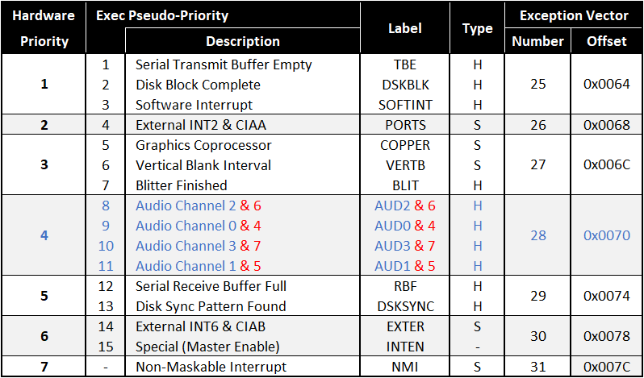

# Vampire SAGA AUDIO chipset

> (C) Copyright 2016-2020 APOLLO-Team


The `SAGA` chipset embeds the legacy `PAULA` 4-channels audio chip.

And extends it to a 8-channels audio chip, including new features.


# PAULA identifier register

* Use this register to detect the `PAULA` version.

* POTINP Bit01 to Bit07 contains the Chip ID code.


NAME      | ADDR | R/W | FUNCTION
--------- | ---- | --- | --------
POTINP    | 016  | R   | Paula chip ID (0=Paula, 1=Extended)

```
UWORD GetPaulaID()
{
	/* Read Paula Chip ID (0=Paula, 1=Extended) */
	return( ( ( *( volatile UWORD* ) 0xDFF016 ) & 0xFE ) >> 1 );
}
```


# PAULA legacy registers (AUD0 to AUD3)

Specifications.


**AUDIO legacy channels**

* `PAULA` offers 4 audio channels, all 8-bits PCM.


NAME      | ADDR | R/W | FUNCTION
--------- | ---- | --- | --------
AUD0      | 0A?  | W   | Channel Number 0
AUD1      | 0B?  | W   | Channel Number 1
AUD2      | 0C?  | W   | Channel Number 2
AUD3      | 0D?  | W   | Channel Number 3


**AUDIO legacy functions per channel**

* Location of waveform data, must be in `Chip RAM`.

* Length of waveform, in words (min=0, max=0xFFFF).

* Volume (min=0, max=64).

* Period (min=2, max=0xFFFF). Example: 3546895 / 22050.


NAME      | ADDR | R/W | FUNCTION
--------- | ---- | --- | --------
AUD?LCH   | 0?0  | W   | Audio channel ? location (high 3 bits, 5 if ECS)
AUD?LCL   | 0?2  | W   | Audio channel ? location (low 15 bits)
AUD?LEN   | 0?4  | W   | Audio channel ? length
AUD?PER   | 0?6  | W   | Audio channel ? period
AUD?VOL   | 0?8  | W   | Audio channel ? volume
AUD?DAT   | 0?A  | W   | Audio channel ? data
AUD?      | 0?C  |     | Audio channel ? reserved
AUD?      | 0?E  |     | Audio channel ? reserved

```
/*
**	custom.h
*/
    struct AudChannel {
      UWORD *ac_ptr;    /* ptr to start of waveform data */
      UWORD  ac_len;    /* length of waveform in words */
      UWORD  ac_per;    /* sample period */
      UWORD  ac_vol;    /* volume */
      UWORD  ac_dat;    /* sample pair */
      UWORD  ac_pad[2]; /* unused */
    } aud[4];
```


**AUDIO legacy control registers**

* ADKCON bits

* DMACON bits

* INTENA bits

* INTREQ bits


NAME      | ADDR | R/W | FUNCTION
--------- | ---- | --- | --------
ADKCONR   | 010  | R   | Audio control          (Bit00 to Bit07, for AUD0 to AUD3)
ADKCON    | 09E  | W   | Audio control          (Bit00 to Bit07, for AUD0 to AUD3)
DMACONR   | 002  | R   | DMA control            (Bit00 to Bit03, for AUD0 to AUD3)
DMACON    | 096  | W   | DMA control            (Bit00 to Bit03, for AUD0 to AUD3)
INTENAR   | 01C  | R   | Interrupt enable bits  (Bit07 to Bit10, for AUD0 to AUD3)
INTENA    | 09A  | W   | Interrupt enable bits  (Bit07 to Bit10, for AUD0 to AUD3)
INTREQR   | 01E  | R   | Interrupt request bits (Bit07 to Bit10, for AUD0 to AUD3)
INTREQ    | 09C  | W   | Interrupt request bits (Bit07 to Bit10, for AUD0 to AUD3)

```
/*
**	dmabits.h
*/

#define DMAB_SETCLR  (15)
#define DMAB_AUD3    (3)
#define DMAB_AUD2    (2)
#define DMAB_AUD1    (1)
#define DMAB_AUD0    (0)

#define DMAF_SETCLR  (1L<<15)
#define DMAF_AUD3    (1L<<3)
#define DMAF_AUD2    (1L<<2)
#define DMAF_AUD1    (1L<<1)
#define DMAF_AUD0    (1L<<0)
```

```
/*
**	intbits.h
*/

#define  INTB_SETCLR  (15)  /* Set/Clear control bit. */
#define  INTB_AUD3    (10)  /* Audio channel 3 block finished */
#define  INTB_AUD2    (9)   /* Audio channel 2 block finished */
#define  INTB_AUD1    (8)   /* Audio channel 1 block finished */
#define  INTB_AUD0    (7)   /* Audio channel 0 block finished */

#define  INTF_SETCLR  (1L<<15)
#define  INTF_AUD3    (1L<<10)
#define  INTF_AUD2    (1L<<9)
#define  INTF_AUD1    (1L<<8)
#define  INTF_AUD0    (1L<<7)
```


# PAULA extended registers (AUD4 to AUD7)

Specifications.


**AUDIO extended channels**

* `SAGA` offers 8 audio channels, all 8-bits or 16-bits PCM.

* The first 4 channels (AUD0 to AUD3) are accessibles either from the legacy audio register set (from DFF0Ax to DFF0Dx), 

* or from the new audio register set (from DFF40x to DFF43x), which allows to use the new `SAGA` features on them.

* The new additional channels (AUD4 to AUD7) must be accessed from the new audio register set (from DFF44x to DFF47x).


NAME      | ADDR | R/W | FUNCTION
--------- | ---- | --- | --------
SAUD0     | 40?  | W   | Channel Number 0
SAUD1     | 41?  | W   | Channel Number 1
SAUD2     | 42?  | W   | Channel Number 2
SAUD3     | 43?  | W   | Channel Number 3
SAUD4     | 44?  | W   | Channel Number 4
SAUD5     | 45?  | W   | Channel Number 5
SAUD6     | 46?  | W   | Channel Number 6
SAUD7     | 47?  | W   | Channel Number 7


**AUDIO extended functions per channel**

* Location of waveform data is a 32-bits address, can be in `Chip RAM` or in `Fast RAM`.

* Length of waveform, in words, is also 32-bits (min=0, max=0x00FFFFFF).

* Volume is 8.8 for Left and Right (min=0.0, max=128.128).

* Control bits for the 8/16-bits, Continuous/OneShot, and Mono/Stereo modes.

* Period (min=2, max=0xFFFF). Example: 3546895 / 22050.


NAME      | ADDR | R/W | FUNCTION
--------- | ---- | --- | --------
SAUD?LCH  | 4?0  | W   | Audio channel ? location (high)
SAUD?LCL  | 4?2  | W   | Audio channel ? location (low)
SAUD?LENH | 4?4  | W   | Audio channel ? length (high)
SAUD?LENL | 4?6  | W   | Audio channel ? length (low)
SAUD?VOL  | 4?8  | W   | Audio channel ? volume
SAUD?CTL  | 4?A  | W   | Audio channel ? control bits
SAUD?PER  | 4?C  | W   | Audio channel ? period
SAUD?     | 4?E  |     | Audio channel ? reserved

```
/*
**	custom2.h
*/
    /*
    ** struct SAudChannel* saud = (struct SAudChannel*)0xDFF400;
    ** saud[channel].ac_ptr = (ULONG*)ptr;
    ** saud[channel].ac_len = (ULONG)len;
    ** saud[channel].ac_vol = (UWORD)(voll<<8)|volr;
    ** saud[channel].ac_ctl = (UWORD)ctl;
    ** saud[channel].ac_per = (UWORD)per;
    */
    
    struct SAudChannel
    {
      ULONG *ac_ptr;   /* ptr to start of waveform data */
      ULONG  ac_len;   /* length of waveform in words */
      UWORD  ac_vol;   /* volume (8.8) (L.R) (max = 128.128) */
      UWORD  ac_ctl;   /* control bits (16bits, oneshot, stereo) */
      UWORD  ac_per;   /* sample period (min = 2, max = 0xFFFF) */
      UWORD  ac_pad;   /* unused */
    } aud[8];

/* new defines for ADKCON */
#define ADKCONR1  0xDFF010
#define ADKCONR2  0xDFF210
#define ADKCON1   0xDFF09E
#define ADKCON2   0xDFF29E

/* new defines for DMACON */
#define DMACONR1  0xDFF002
#define DMACONR2  0xDFF202
#define DMACON1   0xDFF096
#define DMACON2   0xDFF296

/* new defines for INTENA */
#define INTENAR1  0xDFF01C
#define INTENAR2  0xDFF21C
#define INTENA1   0xDFF09A
#define INTENA2   0xDFF29A

/* new defines for INTREQ */
#define INTREQR1  0xDFF01E
#define INTREQR2  0xDFF21E
#define INTREQ1   0xDFF09C
#define INTREQ2   0xDFF29C

/* new defines for SAUDxCTL */
#define SAUDCTLB_STEREO  (2)
#define SAUDCTLB_ONESHOT (1)
#define SAUDCTLB_16BITS  (0)
#define SAUDCTLF_STEREO  (1L<<2)
#define SAUDCTLF_ONESHOT (1L<<1)
#define SAUDCTLF_16BITS  (1L<<0)
```


**AUDIO extended control registers**

* New DMACON bits

* New INTENA bits

* New INTREQ bits


NAME      | ADDR | R/W | FUNCTION
--------- | ---- | --- | --------
ADKCONR2  | 210  | R   | Audio control (Bit00 to Bit07, for AUD4 to AUD7) _UNUSED_
ADKCON2   | 29E  | W   | Audio control (Bit00 to Bit07, for AUD4 to AUD7) _UNUSED_
DMACONR2  | 202  | R   | DMA control (Bit00 to Bit03, for AUD4 to AUD7)
DMACON2   | 296  | W   | DMA control (Bit00 to Bit03, for AUD4 to AUD7)
INTENAR2  | 21C  | R   | Interrupt enable bits (Bit00 to Bit03, for AUD4 to AUD7)
INTENA2   | 29A  | W   | Interrupt enable bits (Bit00 to Bit03, for AUD4 to AUD7)
INTREQR2  | 21E  | R   | Interrupt request bits (Bit00 to Bit03, for AUD4 to AUD7)
INTREQ2   | 29C  | W   | Interrupt request bits (Bit00 to Bit03, for AUD4 to AUD7)


```
/*
**	dmabits2.h
*/

#define DMAB_SETCLR  (15)
#define DMAB_AUD7    (3)
#define DMAB_AUD6    (2)
#define DMAB_AUD5    (1)
#define DMAB_AUD4    (0)

#define DMAF_SETCLR  (1L<<15)
#define DMAF_AUD7    (1L<<3)
#define DMAF_AUD6    (1L<<2)
#define DMAF_AUD5    (1L<<1)
#define DMAF_AUD4    (1L<<0)
```

```
/*
**	intbits2.h
*/

#define  INTB_SETCLR  (15)  /* Set/Clear control bit. */
#define  INTB_AUD7    (3)   /* Audio channel 7 block finished */
#define  INTB_AUD6    (2)   /* Audio channel 6 block finished */
#define  INTB_AUD5    (1)   /* Audio channel 5 block finished */
#define  INTB_AUD4    (0)   /* Audio channel 4 block finished */

#define  INTF_SETCLR  (1L<<15)
#define  INTF_AUD7    (1L<<3)
#define  INTF_AUD6    (1L<<2)
#define  INTF_AUD5    (1L<<1)
#define  INTF_AUD4    (1L<<0)
```


# PAULA interrupt vectors (AUD0 to AUD7)




