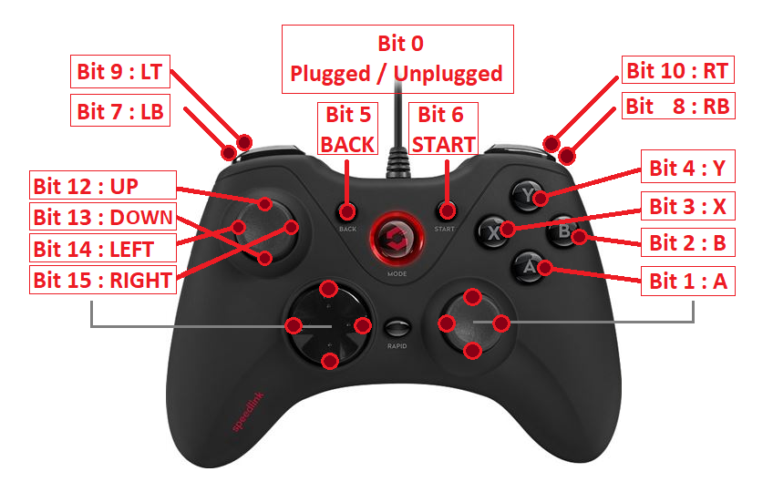

# Vampire SAGA USB JOYPAD chipset

> (C) Copyright 2016-2021 APOLLO-Team

This article describes all the `SAGA` joypad features, and is still in **Work In Progress** status.


# License

This documentation and associated files are licensed under the [Mozilla Public License 2.0](../LICENSE)

Permissions of this weak copyleft license are conditioned on making available source code of licensed files and modifications of those files under the same license (or in certain cases, one of the GNU licenses). Copyright and license notices must be preserved. Contributors provide an express grant of patent rights. However, a larger work using the licensed work may be distributed under different terms and without source code for files added in the larger work.

# Documentation

Written and maintained by `flype`, with the great help from the `APOLLO-Team` members. It is intended for developers who plan to use the `Vampire` audio chip for their programs or games, and to help the community to write drivers. All specifications mentioned in this documentation always refers to the latest version. Be sure to use the latest `Vampire` core version in your programs (see below).

# Core releases

Latest `Vampire` cores are officially distributed from [here](https://www.apollo-accelerators.com/wiki/doku.php/start#core_and_software_updates). 

Additionally, Beta cores are regularly distributed in the official `ApolloTeam` Discord Channel [here](https://discord.gg/bM684VW).

# Introduction

The `SAGA` chipset provides additional registers to read the dedicated Vampire USB JOYPADs.

It is only available on the `Vampire` **standalone** cards, contrary to the `Vampire` **accelerators** cards.

# Illustration



# Registers

This 16-bit Read-Only Register reads the V4+ USB Joypads state.

It contains bits state for plug/unplug, directions and buttons.

NAME      | ADDRESS | R/W | FUNCTION
--------- | ------- | --- | --------
JOYP1     | DFF220  |  R  | Joypad Number 1 State
JOYP2     | DFF222  |  R  | Joypad Number 2 State
JOYP3     | DFF224  |  R  | Joypad Number 3 State
JOYP4     | DFF226  |  R  | Joypad Number 4 State

# Description

```c
#define VREG_JOYP1      0xdff220 // (R) (16-bit)
#define VREG_JOYP2      0xdff222 // (R) (16-bit)
#define VREG_JOYP3      0xdff224 // (R) (16-bit)
#define VREG_JOYP4      0xdff226 // (R) (16-bit)

#define VJOYB_PLUGGED   0        // PLUG
#define VJOYB_A         1        // FIRE1
#define VJOYB_B         2        // FIRE2
#define VJOYB_X         3        // FIRE3
#define VJOYB_Y         4        // FIRE4
#define VJOYB_BACK      5        // FIRE5
#define VJOYB_PLAY      6        // FIRE6
#define VJOYB_LB        7        // FIRE7
#define VJOYB_RB        8        // FIRE8
#define VJOYB_LT        9        // BACK
#define VJOYB_RT        10       // START
#define VJOYB_FREE      11       // RESERVED
#define VJOYB_UP        12       // UP
#define VJOYB_DOWN      13       // DOWN
#define VJOYB_LEFT      14       // LEFT
#define VJOYB_RIGHT     15       // RIGHT

#define VJOYF_PLUGGED   (1 << VJOYB_PLUGGED)
#define VJOYF_A         (1 << VJOYB_A)
#define VJOYF_B         (1 << VJOYB_B)
#define VJOYF_X         (1 << VJOYB_X)
#define VJOYF_Y         (1 << VJOYB_Y)
#define VJOYF_BACK      (1 << VJOYB_BACK)
#define VJOYF_PLAY      (1 << VJOYB_PLAY)
#define VJOYF_LB        (1 << VJOYB_LB)
#define VJOYF_RB        (1 << VJOYB_RB)
#define VJOYF_LT        (1 << VJOYB_LT)
#define VJOYF_RT        (1 << VJOYB_RT)
#define VJOYF_FREE      (1 << VJOYB_FREE)
#define VJOYF_UP        (1 << VJOYB_UP)
#define VJOYF_DOWN      (1 << VJOYB_DOWN)
#define VJOYF_LEFT      (1 << VJOYB_LEFT)
#define VJOYF_RIGHT     (1 << VJOYB_RIGHT)
```
